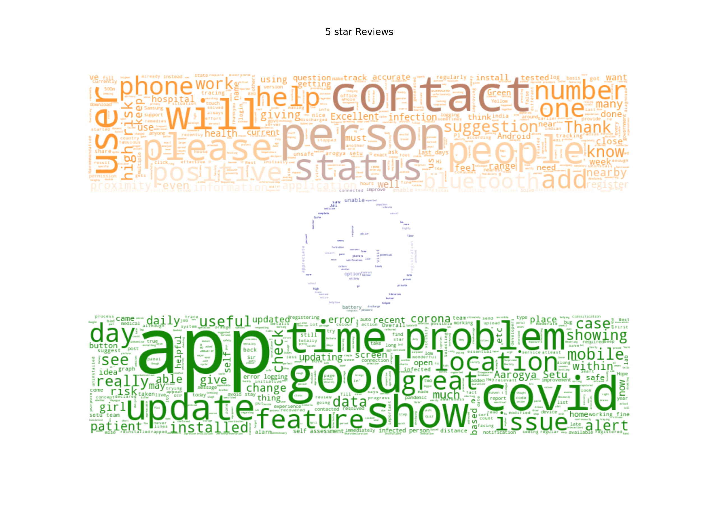
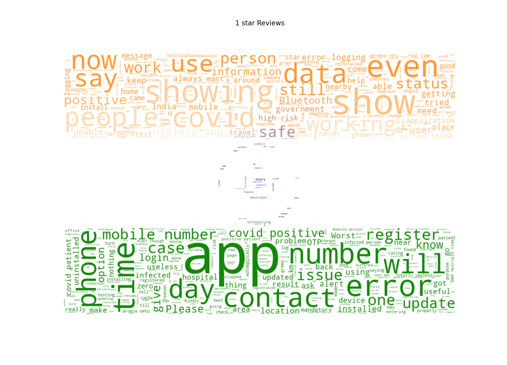

# Google Play Store Applications Review Scraper 📜

A simple application review scraper made with the 💪 of Selenium and Beautiful 🍲.


**Free with a WordCloud Generator!** ☁

It creates two beautiful wordcloud in the shape and color of the Indian flag for both Negative and Positive reviews.

# Table of Contents 📄

- [Google Play Store Applications Review Scraper 📜](#google-play-store-applications-review-scraper-)
- [Table of Contents 📄](#table-of-contents-)
  - [Taget application: Arogya Setu 🧡](#taget-application-arogya-setu-)
  - [Libraries used 📚](#libraries-used-)
    - [Selenium](#selenium)
      - [Selenium Web Driver](#selenium-web-driver)
    - [BeautifulSoup](#beautifulsoup)
    - [Pandas](#pandas)
    - [Wordcloud](#wordcloud)
    - [Numpy](#numpy)
    - [Matplotlib](#matplotlib)
- [Running the application ⚙](#running-the-application-)
  - [Setting up your environmnet](#setting-up-your-environmnet)
    - [Selenium set-up](#selenium-set-up)
- [Scripts](#scripts)
  - [app_store_reviews.py](#app_store_reviewspy)
  - [generate_wordclouds.py](#generate_wordcloudspy)
- [Result](#result)
  - [Postive Reviews WordCloud](#postive-reviews-wordcloud)
  - [Negative Reviews WordCloud](#negative-reviews-wordcloud)

## Taget application: Arogya Setu 🧡


Aarogya Setu is an Indian COVID–19 "contact tracing, syndromic mapping and self-assessment" digital service, primarily a mobile app, developed by the National Informatics Centre under the Ministry of Electronics and Information Technology. The app reached more than 100 million installs in 40 days.

Due to mixed views of the general audience, reviews of this application create a perfect mix of positive and Negative reviews.

## Libraries used 📚

### Selenium

Selenium is an open-source tool that automates web browsers. It provides a single interface that lets you write test scripts in programming languages like Ruby, Java, NodeJS, PHP, Perl, Python, and C#, among others.

#### Selenium Web Driver

Executable module that opens up a browser instance and runs the test script. Browser-specific—for instance, Google develops and maintains Chromedriver for Selenium to support automation on Chromium/Chrome.

Modern websites, like the Google Play store are built heavily using JavaScript which needs user interaction to load content. Since manually loading each review would be a tedious task, selenium provides a way to load more reviews by scrolling and clikcing on buttons.

### BeautifulSoup

Beautiful Soup is a Python package for parsing HTML and XML documents. It creates a parse tree for parsed pages that can be used to extract data from HTML, which is useful for web scraping.

### Pandas

Pandas is a software library written for the Python programming language for data manipulation and analysis. In particular, it offers data structures and operations for manipulating numerical tables and time series.

In our case, pandas provides a way to store the reviews table to save into a csv file and load it later for our Wordcloud generator.

### [Wordcloud](https://github.com/amueller/word_cloud)

A simple library to generate Wordcloud.

### Numpy

NumPy is a library for the Python programming language, adding support for large, multi-dimensional arrays and matrices, along with a large collection of high-level mathematical functions to operate on these arrays.

It stored the image array to use in Wordcloud in our case.

### Matplotlib

Matplotlib is a plotting library for the Python programming language and its numerical mathematics extension NumPy.

This was used in extension with Wordcloud to display and save the generated cloud.

# Running the application ⚙

## Setting up your environmnet

The quickest way to setup your python environment would be to use the provided [`environment.yml`](misc/environment.yml) file 

1. Install Anaconda
2. Run the command 
   
   ```
   conda env create -f environment.yml
   ```
    This will create an enironment with name py36

3. Activate the environment with
   
   ```
   conda activate py36
   ```
4. Install WordCloud by running

    ```
    pip install wordcloud
    ```

### Selenium set-up

Use the attached chromedriver to run selenium for `Chrome Ver. 87`. 
Refer the [Official Selenium Webbdriver Docs](https://www.selenium.dev/documentation/en/webdriver/) if you are using another browser or version.

Put the webdriver in your system `PATH` or in th working directory.

# Scripts

A Jupyter notebook is perent in the `misc/` directory with the name [`buildenv.ipynb`](misc\buildenv.ipynb) which was used to create both the scripts as Jupyter provides a breakdown of the whole program cell-by-cell with easy execution if any error arises on any block.

## app_store_reviews.py

This script uses selenium to open the application page for ArogyaSetu app and scrolls down and clicks on `SHOW MORE` for about 20 times to load enough reviews to scrape.

After the reviews are loaded, selenium driver then Expands all the reviews on the page.

BeautifulSoup now takes over and loads the HTML content on a variable and we use its in-built functions to extract all the content from the HTML source using class and tag accessors.

All of the data is then stored in a pandas dataframe which then saves it to [`ArogyaSetuReviews.csv`](data\ArogyaSetuReviews.csv) in `data/` directory.

## generate_wordclouds.py

This script loads the saved csv files in a pandas dataframe, extracts all the positive and negative reviews in two giant strings.

A mask is loaded of the Indian Flag from `img/` directory.

Wordcloud library then creates the Wordclouds which is then masked, displayed and saved with the help of Matplotlib in `img/` directory.

# Result

## Postive Reviews WordCloud



## Negative Reviews WordCloud


